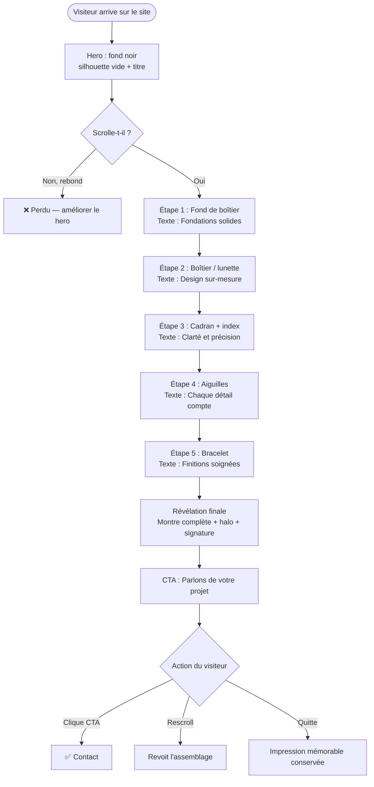
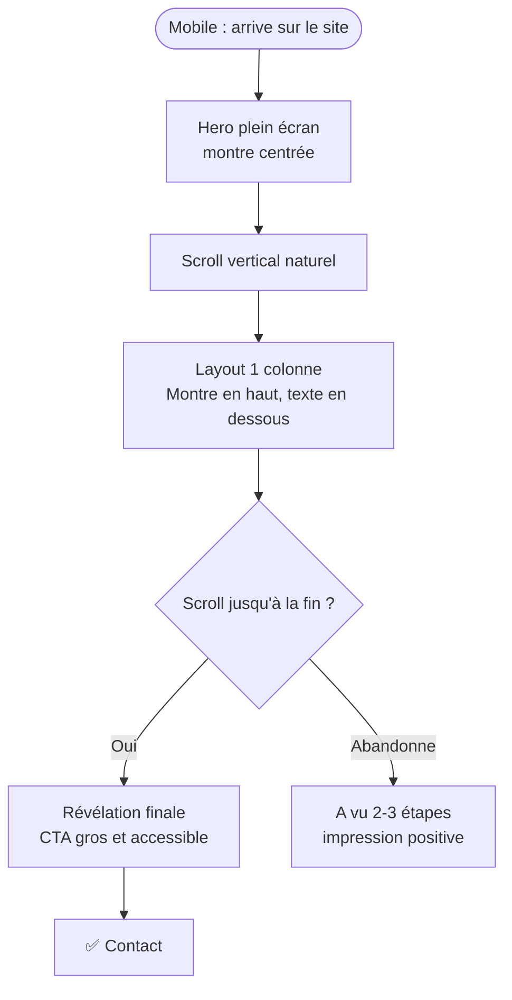
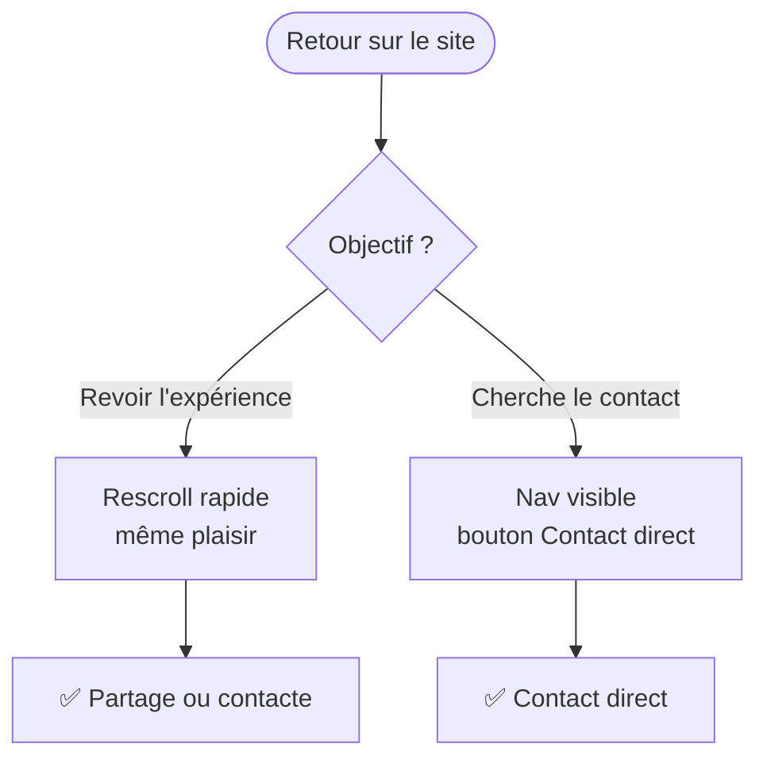

# UX Design Specification — site vitrine pour montre

**Author:** ghilas
**Date:** 2026-05-08

---

<!-- UX design content will be appended sequentially through collaborative workflow steps -->

## Executive Summary

### Project Vision

Un site portfolio one-page conçu pour convertir des visiteurs en clients.
L'expérience centrale est une animation scroll-driven où une montre fictive
de luxe (inspirée de l'univers Rolex) se construit progressivement — cadre
vide en haut, montre complète en bas. **L'assemblage est volontairement limité
à 5–7 composants clés** pour garder un rythme cinématographique sans lasser.
Le site démontre par l'acte lui-même les compétences de son créateur : chaque
pixel est une preuve de savoir-faire.

Référence visuelle principale : rolex.com — fond noir profond, typographie
aérée, espacement généreux, la pièce maîtresse EST le sujet.

### Target Users

**Décideurs d'entreprises** (dirigeants, responsables marketing, chefs de
projet) de toute taille — d'une PME locale cherchant sa première présence
web à une grande entreprise voulant refondre son image. Ils ne sont pas
forcément tech, mais ils reconnaissent immédiatement quand quelque chose
est beau et bien fait. Ils jugent en 8 secondes.

Appareil principal : desktop (pour apprécier l'animation plein écran),
mobile en version dégradée élégante.

### Key Design Challenges

1. **Chorégraphier l'assemblage (5–7 composants)** : fond, boîtier, cadran,
   aiguilles, bracelet — chaque élément apparaît dans un ordre narratif logique
   et visuellement satisfaisant. Concis et percutant, pas exhaustif.

2. **Équilibre spectacle / lisibilité** : l'animation est la star, mais le
   visiteur doit aussi comprendre ce que Ghilas propose comme services et
   pouvoir le contacter. Ne pas sacrifier l'utilité sur l'autel du "wow".

3. **Performance** : une animation complexe qui rame tue l'effet luxe
   instantanément. Fluidité 60fps non-négociable.

### Design Opportunities

1. **Chaque composant = un message** : à mesure que la montre s'assemble,
   des micro-textes lient chaque pièce à une compétence (ex: le cadran →
   "Interfaces claires et précises").

2. **La métaphore "artisan du web"** : assembler une montre de luxe au
   scroll positionne Ghilas comme un artisan qui construit avec soin et
   précision — pas une usine à sites.

3. **CTA naturel en fin de scroll** : quand la montre est complète, le
   visiteur ressent une satisfaction — c'est le moment idéal pour le CTA
   "Parlons de votre projet".

## Core User Experience

### Defining Experience

L'action centrale est **le scroll passif contemplatif** — le visiteur ne fait
que descendre la page, et le site récompense chaque centimètre de scroll par
une révélation visuelle. C'est une expérience de spectateur, pas d'utilisateur.
Aucun clic requis, aucune décision à prendre. Juste regarder quelque chose de
beau se construire devant soi.

L'assemblage se déroule en 5 à 7 étapes distinctes :
1. Fond / fond de boîtier (silhouette vide)
2. Boîtier extérieur (lunette)
3. Cadran (couleur, index, chiffres)
4. Aiguilles (heures, minutes, secondes)
5. Bracelet (maillons)
6. Couronne et finitions
7. Révélation finale — montre complète, éclat, signature "Ghilas — Web Artisan"

### Platform Strategy

- **Plateforme principale : Web desktop** — l'animation plein écran sur grand
  écran est l'expérience cible. La montre occupe 60–70% de la hauteur visible.
- **Mobile : version dégradée élégante** — animation simplifiée, composants
  qui fade-in au scroll, même impact émotionnel dans un format adapté.
- **Pas d'offline, pas d'app** — site statique HTML/CSS/JS, ultra-rapide,
  zéro dépendance externe.
- **Scroll natif** — pas de scroll hijacking agressif, juste du
  scroll-linked animation (IntersectionObserver + CSS scroll-timeline).

### Effortless Interactions

- **Zéro friction** : le visiteur ne fait rien d'autre que scrolller. Pas de
  boutons à cliquer pour voir la suite, pas de loaders, pas de formulaires
  avant la fin.
- **Transitions imperceptibles** : chaque composant de la montre apparaît
  sans saccade — fondu, glissement ou scale subtil. Le cerveau perçoit
  "fluide" avant de percevoir "animé".
- **Navigation invisible** : le menu existe mais ne s'impose pas. Il se
  glisse en haut en position fixed, transparent sur le dark, discret.

### Critical Success Moments

1. **Les 3 premières secondes** : le hero doit arrêter le scroll. Fond noir,
   silhouette de montre à peine visible, lumière rasante — le visiteur doit
   sentir qu'il va voir quelque chose de rare.
2. **Premier composant qui apparaît** : le "oh" moment. Si la première pièce
   de la montre apparaît avec classe (pas un simple fade mais quelque chose
   avec du caractère), le visiteur est capturé pour la suite.
3. **Montre complète** : le moment de satisfaction. Une légère animation de
   "polish" (reflet de lumière, tick des aiguilles) signe l'assemblage.
   C'est le moment où le CTA apparaît naturellement.

### Experience Principles

1. **Le silence est du luxe** : aucun élément superflu. Chaque pixel justifie
   sa présence. Pas de bannières, pas de popups, pas de widgets sociaux.
2. **Le scroll est la narration** : la vitesse de scroll du visiteur contrôle
   le rythme du récit. Il est le réalisateur de son propre film.
3. **Montrer avant de dire** : les compétences de Ghilas sont prouvées par le
   site lui-même — pas par une liste de bullet points "je sais faire du CSS".
4. **La montre est une métaphore vivante** : précision, patience, artisanat —
   les mêmes valeurs que dans la création de sites web professionnels.

## Desired Emotional Response

### Primary Emotional Goals

L'objectif émotionnel n°1 est résumé par la phrase de Ghilas lui-même :
**"P***, c'est un site de malade."**

Techniquement, cela se traduit par :
- **Émerveillement** au premier regard (arrêt du scroll, dilatation des pupilles)
- **Désir** pendant l'assemblage (l'envie de voir la suite, de ne pas quitter)
- **Confiance** une fois la montre complète (ce designer sait ce qu'il fait)
- **Envie d'agir** au CTA (contacter Ghilas immédiatement)

### Emotional Journey Mapping

| Moment | Émotion cible |
|--------|--------------|
| Arrivée sur le site | Curiosité intriguée — "qu'est-ce que c'est ?" |
| Hero noir avec silhouette | Élégance ressentie, ralentissement du scroll |
| 1er composant de la montre | Surprise + plaisir — "oh, je vois ce qui se passe" |
| Assemblage en cours | Fascination + anticipation — envie de continuer |
| Montre complète | Satisfaction + admiration — "wow" |
| CTA final | Confiance + désir — "je veux travailler avec cette personne" |
| Retour sur le site | Nostalgie positive — "je veux revoir ça" |

### Micro-Emotions

- ✅ **Confiance** (pas de scepticisme) : le site lui-même prouve les compétences
- ✅ **Excitation** (pas d'anxiété) : rien de déroutant, tout est intuitif
- ✅ **Admiration** (pas de jalousie) : le visiteur veut avoir ce niveau pour son propre site
- ✅ **Accomplissement** (pas de frustration) : le scroll récompense à chaque pixel
- ❌ À éviter : sentiment d'être "vendu à", sentiment de gimmick, impatience

### Design Implications

- **Émerveillement** → Pas d'éléments UI génériques. Tout est custom, tout
  est précis. Même la scrollbar peut être stylisée.
- **Désir de continuer** → Chaque composant de montre doit avoir un léger
  "tease" : on entrevoit le suivant avant qu'il apparaisse vraiment.
- **Confiance** → Les micro-textes liés à chaque composant sont courts,
  directs, professionnels — jamais vendeurs ou vantards.
- **Envie d'agir** → Le CTA final n'est pas un bouton générique "Contact" :
  c'est une invitation naturelle qui découle de l'émotion du moment.

### Emotional Design Principles

1. **Chaque animation doit mériter son existence** : si elle n'apporte pas
   d'émotion, elle est supprimée.
2. **L'émotion prime sur l'information** : on ressent avant de lire.
3. **La satisfaction de l'assemblage complet est sacrée** : ne pas la gâcher
   avec un popup, une pub, un widget chat intrusif.
4. **Le dark est une décision émotionnelle** : le noir crée du mystère,
   de la rareté, du luxe — c'est un choix narratif, pas esthétique.

## UX Pattern Analysis & Inspiration

### Inspiring Products Analysis

#### 1. Rolex.com — Référence principale
- **Ce qu'ils font brillamment** : la montre est le seul sujet. Zéro bruit
  visuel. Chaque photo est une œuvre. Le fond noir transforme la montre en
  objet flottant dans l'espace.
- **Pattern clé** : full-screen takeover — l'objet occupe tout, le texte
  s'efface en comparaison.
- **À adopter** : la typographie aérée uppercase, le ratio espace/contenu
  très généreux, la palette noir/or/blanc crème.

#### 2. Apple — Pages produit (iPhone, MacBook)
- **Ce qu'ils font brillamment** : scroll-driven storytelling où chaque
  section révèle une nouvelle facette du produit. Le produit tourne, se
  démonte, se recompose.
- **Pattern clé** : sticky section avec progression scroll — l'objet reste
  centré pendant que le contexte change autour de lui.
- **À adopter** : la montre reste au centre de l'écran pendant l'assemblage,
  stable, pendant que les composants viennent se greffer.

#### 3. Awwwards SOTD — Sites portfolio d'excellence
- **Ce qu'ils font brillamment** : entrées animées avec intention, curseur
  custom, typographie expressive, transitions surprenantes.
- **Pattern clé** : chaque interaction est une mini-expérience en soi.
- **À adopter** : curseur custom subtil (cercle lumineux sur fond sombre),
  transition de section avec effet de fondu.

### Transferable UX Patterns

**Patterns de scroll/animation :**
- **Sticky center object** (Apple) → La montre reste fixe au centre, les
  composants arrivent autour d'elle
- **Scroll-linked opacity + transform** → Chaque composant fade-in + légère
  translation Y (monte légèrement en apparaissant) — doux, pas agressif
- **Section naturelle ~100vh** → Chaque étape d'assemblage occupe une hauteur
  d'écran, le scroll donne un rythme naturel

**Patterns visuels :**
- **Lumière rasante sur objet sombre** (Rolex) → Fond #0a0a0a, halo
  directionnel or/blanc — donne de la matière et de la profondeur
- **Typographie flottante** → Texte très léger (font-weight 200-300),
  lettres espacées, disparaît au scroll suivant sans laisser de trace

**Patterns de navigation :**
- **Nav transparente to frosted** → Démarre transparente sur le hero puis
  devient semi-opaque (backdrop-filter: blur) quand on scrolle

### Anti-Patterns to Avoid

- ❌ **Scroll hijacking total** : capturer le scroll au pixel près crée de
  la frustration. On utilise IntersectionObserver, pas de override du scroll.
- ❌ **Trop de composants** : maximum 7, idéalement 5-6.
- ❌ **Texte descriptif dense** : micro-texte seulement (3-5 mots max par composant).
- ❌ **Loading screen long** : site statique léger, chargement quasi-instantané.
- ❌ **CTA prématuré** : pas de "Contactez-moi" avant que la montre soit complète.

### Design Inspiration Strategy

**À adopter directement :**
- Fond #0a0a0a, halo lumineux sur la montre (Rolex)
- Objet central fixe pendant l'assemblage (Apple)
- Typographie uppercase espacée, très légère (Rolex + Awwwards)

**À adapter :**
- Le scroll-timeline Apple : simplifié pour les perfs sur tous navigateurs

**À éviter :**
- Bibliothèques JS lourdes inutiles
- Effets 3D complexes qui rament
- Design "agence digitale 2020" (particules, glitch, néon violet)

## Design System Foundation

### Design System Choice

**→ Système custom sur-mesure. Zéro framework UI.**

Pour un site vitrine portfolio dont l'unique fonction est de prouver
l'excellence de Ghilas, utiliser Material Design ou Tailwind UI enverrait
le mauvais signal. Chaque token de design doit être une décision consciente.

Stack technique : HTML5 + CSS custom properties + vanilla JS.
Pas de React, pas de Vue, pas de bibliothèque de composants.

### Rationale for Selection

1. **Le site EST la démonstration** : un framework visible trahit l'outil
   et diminue l'effet "malade". Le visiteur doit penser "il a tout fait lui-même."
2. **Performance maximale** : zéro dépendance = chargement quasi-instantané.
3. **Contrôle total des animations** : CSS custom properties + JS vanilla
   donnent une précision au pixel sans overhead.
4. **Site statique one-page** : la complexité d'un framework serait disproportionnée.

### Design Tokens

```css
--color-bg:         #0a0a0a;
--color-bg-subtle:  #111111;
--color-gold:       #c9a040;
--color-gold-light: #e8c97a;
--color-cream:      #f5f0e8;
--color-muted:      #6b6b6b;
--color-border:     #1e1e1e;

--font-display: 'Cormorant Garamond', Georgia, serif;
--font-body:    'Inter', system-ui, sans-serif;

--size-3xl:  6rem;
--size-2xl:  3.5rem;
--size-xl:   2rem;
--space-16:  8rem;
--space-8:   4rem;
--space-4:   2rem;

--ease-luxury:     cubic-bezier(0.25, 0.1, 0.25, 1);
--duration-slow:   800ms;
--duration-medium: 400ms;
```

### Implementation Approach

- CSS custom properties pour tous les tokens
- IntersectionObserver API pour déclencher les animations au scroll
- CSS scroll-driven animations avec fallback JS
- SVG inline pour les composants de la montre — scalable, animable, léger
- Google Fonts : Cormorant Garamond + Inter

### Customization Strategy

Les composants de la montre sont des SVG paths stylisés avec les tokens
gold/cream. Chaque élément a un `data-watch-part` attribute pour que le JS
puisse les cibler précisément lors de l'assemblage au scroll.

## 2. Core User Experience

### 2.1 Defining Experience

**L'expérience définissante : "Scroll pour assembler la montre"**

Comme Tinder avec le swipe, l'action est irréductible : l'utilisateur
scrolle, la montre se construit. C'est le seul verbe du site.
Si on nail ça, tout le reste suit.

### 2.2 User Mental Model

Le visiteur arrive sans mode d'emploi. Son modèle mental naturel :
- Il voit un fond noir et une silhouette vague → instinct : "il faut
  descendre pour voir la suite"
- Il scrolle → quelque chose se passe → son cerveau comprend le contrat :
  *"chaque scroll révèle quelque chose"*
- Il continue, capturé par l'envie de voir la montre complète

Aucune éducation nécessaire. Le site enseigne son propre langage en 3 secondes.

### 2.3 Success Criteria

- ✅ Le visiteur scrolle jusqu'en bas sans s'arrêter (taux de completion > 80%)
- ✅ Chaque composant apparaît en moins de 600ms après le déclencheur scroll
- ✅ Aucun lag, aucune saccade visible même sur machine modeste
- ✅ Sur mobile, l'expérience reste lisible et émotionnellement équivalente
- ✅ Le CTA en bas est cliqué par au moins 10% des visiteurs

### 2.4 Novel UX Patterns

**Pattern 1 — Scroll storytelling** (Apple, Stripe) : connu, le visiteur
comprend instinctivement. On adopte ce pattern.

**Pattern 2 — Assemblage progressif d'objet** : notre twist unique.
La montre n'est pas une métaphore abstraite — elle se construit littéralement.

**Notre innovation** : lier chaque composant physique à une compétence réelle
de Ghilas. L'objet et le message fusionnent.

### 2.5 Experience Mechanics

**Séquence d'assemblage (6 étapes) :**

| Étape | Composant SVG | Micro-texte | Déclencheur scroll |
|-------|--------------|-------------|-------------------|
| 0 | Silhouette vide | *(silence)* | Arrivée |
| 1 | Fond de boîtier | "Fondations solides" | 15% |
| 2 | Boîtier / lunette | "Design sur-mesure" | 30% |
| 3 | Cadran + index | "Clarté & précision" | 45% |
| 4 | Aiguilles | "Chaque détail compte" | 60% |
| 5 | Bracelet | "Finitions soignées" | 75% |
| 6 | Révélation finale + halo | "Ghilas — Web Artisan" | 90% |

**Mécanique de chaque étape :**
1. IntersectionObserver détecte le scroll threshold
2. Composant SVG : opacity 0→1 + translateY(20px→0), 600–800ms, ease-luxury
3. Léger halo doré autour du nouveau composant (2s, puis fondu)
4. Micro-texte fade-in 200ms après, reste 3s puis disparaît doucement

**Étape finale :**
- Rotation lente des aiguilles (1 tour en 4s) + reflet de lumière sur lunette
- Signature "Ghilas — Web Artisan" apparaît sous la montre
- CTA monte depuis le bas : "Parlons de votre projet →"

**Contrainte technique :** CI/CD avec branches GitHub à mettre en place
(aucune régression de code). À transmettre à l'architecte et développeuse.

## Visual Design Foundation

### Color System

**Palette principale — "Dark Luxe"**

| Token | Valeur | Usage |
|-------|--------|-------|
| `--color-bg` | `#0a0a0a` | Fond principal — noir charbon |
| `--color-bg-subtle` | `#111111` | Variations de fond, hover states |
| `--color-bg-card` | `#141414` | Surfaces légèrement relevées |
| `--color-gold` | `#c9a040` | Accent principal — or champagne |
| `--color-gold-light` | `#e8c97a` | Reflets, hovers, halos |
| `--color-gold-dark` | `#8a6a20` | Or sombre, ombres chaudes |
| `--color-cream` | `#f5f0e8` | Texte principal sur fond noir |
| `--color-muted` | `#6b6b6b` | Texte secondaire, micro-textes |
| `--color-border` | `#1e1e1e` | Séparateurs, contours subtils |

**Accessibilité :**
- Cream `#f5f0e8` sur `#0a0a0a` → ratio 16.8:1 ✅ WCAG AAA
- Gold `#c9a040` sur `#0a0a0a` → ratio 7.2:1 ✅ WCAG AA
- Muted `#6b6b6b` sur `#0a0a0a` → ratio 4.6:1 ✅ WCAG AA (texte large)

### Typography System

**Duo typographique :**

**Cormorant Garamond** — Display / Titres
- Serif élégant, historiquement associé à l'imprimerie de luxe
- Font-weight : 300 (light) et 600 (semibold)
- Letter-spacing : 0.1em à 0.3em

**Inter** — Body / UI
- Sans-serif moderne, parfaite lisibilité à petite taille
- Font-weight : 300 et 400

**Échelle typographique :**

| Rôle | Font | Size | Weight | Tracking |
|------|------|------|--------|---------|
| Hero title | Cormorant | 6–8rem | 300 | 0.2em |
| Section title | Cormorant | 3rem | 300 | 0.15em |
| Composant label | Cormorant | 1.5rem | 300 | 0.3em |
| Micro-texte | Inter | 0.75rem | 300 | 0.15em |
| Nav | Inter | 0.875rem | 400 | 0.1em |
| CTA | Inter | 1rem | 400 | 0.05em |

**Règle** : tout en minuscules. L'élégance est dans la discrétion.

### Spacing & Layout Foundation

**Layout** : centré, max-width 1200px, padding `64px` desktop / `24px` mobile.
**La montre** : cercle 400–500px, centré dans chaque section.
**Sections** : `100vh` minimum — une scène = un écran.

| Token | Valeur | Usage |
|-------|--------|-------|
| `--space-1` | 8px | Micro-espacement |
| `--space-2` | 16px | Éléments proches |
| `--space-4` | 32px | Espacement standard |
| `--space-8` | 64px | Entre sections |
| `--space-16` | 128px | Marges luxueuses |

Scrollbar custom : 2px, couleur or, fond noir.

## Design Direction Decision

### Design Directions Explored

Trois directions générées et présentées en showcase HTML interactif :
- **A — Pure Noir** : minimalisme extrême, montre seule sur fond vide
- **B — Cinéma Luxe** : halo doré animé, atmosphère dramatique et chaude
- **C — Éditorial Horloger** : layout 2 colonnes, montre + texte narratif

### Chosen Direction

**Hybride B+C — "Cinéma Éditorial"**

- **De B** : halo doré pulsant autour de la montre, fond radial-gradient
  chaud, atmosphère cinématographique premium
- **De C** : layout 2 colonnes (texte à gauche / montre à droite),
  progression visible par étapes, grand numéro d'étape, texte narratif
  qui accompagne chaque composant

### Design Rationale

La montre est **mise en valeur** (B) tout en étant **contextualisée** (C).
Le visiteur est à la fois ébloui par l'objet et informé sur la compétence
qu'il représente. Cette dualité convertit mieux : on impressionne ET on
convainc. La montre occupe ~50% de l'écran visible en permanence — elle
reste reine, mais le texte lui donne du sens.

### Implementation Approach

- Layout CSS Grid 2 colonnes : `1fr 1fr`, `min-height: 100vh`
- Colonne gauche : sticky pendant le scroll, texte et numéro d'étape
- Colonne droite : montre SVG avec halo animé, centré verticalement
- À chaque seuil de scroll : texte gauche change (slide-up) + nouveau
  composant SVG apparaît à droite (fade-in + scale subtil)
- Barre de progression or en haut de la colonne gauche

## User Journey Flows

### Journey 1 — Découverte & Assemblage (Parcours principal)



**Optimisations :**
- Composants déjà apparus restent visibles si scroll s'arrête
- CTA accessible dans la nav en permanence pour les impatients

### Journey 2 — Visiteur Mobile



**Adaptations mobile :**
- Layout 1 colonne, montre ~50vw en haut
- Halo réduit en intensité (économie batterie)
- CTA collant en bas dès la révélation finale

### Journey 3 — Visiteur de retour



### Journey Patterns

- **Nav fixed** : toujours accessible, discrète, avec CTA direct
- **Feedback** : halo 2s par composant + barre de progression or
- **Zéro erreur possible** : site lecture seule, pas de formulaire complexe avant la fin

### Flow Optimization Principles

1. **Zéro décision forcée** : scroll passif, jamais bloqué
2. **Progrès toujours visible** : barre or + composants apparus
3. **CTA mérité** : apparaît au pic émotionnel uniquement
4. **Résilience au scroll partiel** : même 3 étapes laissent une impression forte

## Component Strategy

### Design System Components

Aucun composant de framework externe. Tout est custom, construit
sur nos CSS custom properties.

### Custom Components

#### 1. WatchAssembly
**Purpose :** Montre SVG qui s'assemble progressivement.
**Anatomy :** 6 layers SVG superposés, `data-watch-part="1"` à `"6"`, `opacity: 0` par défaut.
**States :** `idle` (opacity 0, translateY 15px) → `revealed` (opacity 1, translateY 0, 700ms) → `complete` (rotation aiguilles)
**Accessibilité :** `role="img"` `aria-label="Montre artisanale en cours d'assemblage"`

#### 2. ScrollSection
**Purpose :** Section `100vh` déclenchant une étape via IntersectionObserver threshold 0.4.
**States :** `pending` → `active` (dispatch watchReveal) → `passed`

#### 3. StepText
**Purpose :** Numéro géant + label + titre + description dans la colonne gauche.
**Anatomy :** `.step-number` (8rem discret) / `.step-label` (gold uppercase) / `.step-title` (Cormorant 3rem) / `.step-desc` (muted)
**States :** `hidden` → `entering` (400ms) → `visible` → `exiting` (fade-out avant le suivant)

#### 4. ProgressBar
**Purpose :** 6 segments qui passent de border à gold au fil des étapes.
**Position :** Fixed en haut de la colonne gauche desktop / sous nav mobile.

#### 5. NavBar
**Purpose :** Logo + liens + CTA contact, toujours accessible.
**States :** `transparent` (hero) → `frosted` (après 80px scroll, backdrop-filter blur 12px)

#### 6. WatchGlow
**Purpose :** Halo doré pulsant derrière la montre.
**States :** `pulse` (3s infinite) → `reveal-burst` (éclat gold à chaque nouveau composant)

#### 7. CTAReveal
**Purpose :** CTA qui monte depuis le bas quand la montre est complète.
**States :** `hidden` (translateY 40px) → `revealed` (translateY 0, 800ms ease-luxury)

### Component Implementation Strategy

**Ordre de build :** NavBar → WatchAssembly SVG → ScrollSection → StepText → WatchGlow → ProgressBar → CTAReveal

**Convention CSS :** `.watch-*` / `.step-*` / `.nav-*` / `.cta-*` — états : `.is-visible` / `.is-active` / `.is-complete`

### Implementation Roadmap

- **Phase 1** : WatchAssembly + ScrollSection + StepText (MVP)
- **Phase 2** : NavBar frosted + WatchGlow + ProgressBar
- **Phase 3** : CTAReveal + reduced-motion + mobile

## UX Consistency Patterns

### Button Hierarchy

Ce site a un seul CTA principal — pas de hiérarchie complexe.

| Niveau | Composant | Style | Usage |
|--------|-----------|-------|-------|
| Primaire | CTAReveal | Border gold, fond transparent → gold au hover | "Parlons de votre projet" — une seule fois |
| Nav | NavBar CTA | Border muted, compact | "Contact" toujours accessible |
| Fantôme | Liens nav | Texte muted, underline au hover | Navigation discrète |

**Règle** : jamais deux CTA de même niveau visible simultanément.

### Feedback Patterns

| Situation | Pattern |
|-----------|---------|
| Composant révélé | Halo gold 2s + micro-texte fade-in |
| Montre complète | Animation polish (reflet + tick aiguilles) |
| Hover sur CTA | Background gold subtil + lettre-spacing élargi |
| Hover sur nav | Couleur cream → gold, transition 200ms |
| Scroll progress | Barre segments or se rempli en temps réel |

Pas de toasts, pas d'alerts, pas de modales — le site est en lecture seule.

### Form Patterns

Un seul formulaire : le contact en fin de parcours.

- **Champs** : Nom, Email, Message — minimaliste
- **Labels** : flottants, couleur muted → gold au focus
- **Bordures** : `var(--color-border)` → `var(--color-gold)` au focus
- **Submit** : même style que CTAReveal primaire
- **Validation** : inline, message discret sous le champ, rouge doux `#c0392b`
- **Succès** : remplacement du formulaire par un message "Message envoyé — je reviens vers vous sous 24h"

### Navigation Patterns

- **NavBar fixed** : toujours visible, `z-index: 100`
- **Scroll indicator** : la barre de progression or suffit — pas de dots latéraux
- **Ancres** : les liens nav scrollent en douceur vers les sections (`scroll-behavior: smooth`)
- **Mobile** : hamburger minimal → menu plein écran fond noir, liens centrés en Cormorant

### Animation Patterns

Règles globales applicables à tous les composants :

```css
/* Entrée standard */
.animate-in {
  animation: fadeSlideUp 700ms var(--ease-luxury) forwards;
}
@keyframes fadeSlideUp {
  from { opacity: 0; transform: translateY(20px); }
  to   { opacity: 1; transform: translateY(0); }
}

/* Respect prefers-reduced-motion */
@media (prefers-reduced-motion: reduce) {
  .animate-in { animation: fadeIn 300ms ease forwards; }
  @keyframes fadeIn { from { opacity: 0; } to { opacity: 1; } }
}
```

## Responsive Design & Accessibility

### Responsive Strategy

**Desktop (≥1024px) — Expérience principale**
Layout 2 colonnes CSS Grid `1fr 1fr`. Colonne gauche sticky,
colonne droite montre avec glow. Tout l'espace est utilisé.

**Tablet (768px–1023px) — Adaptation**
Layout 2 colonnes conservé mais proportions ajustées `0.9fr 1.1fr`.
Montre légèrement réduite (380px). Texte plus compact.

**Mobile (< 768px) — Version dégradée élégante**
Layout 1 colonne. Montre centrée en haut (~70vw max 280px),
texte centré en dessous. Halo réduit. Même séquence d'assemblage.

### Breakpoint Strategy

```css
/* Mobile-first */
/* Base : mobile < 768px */
@media (min-width: 768px)  { /* tablet */ }
@media (min-width: 1024px) { /* desktop — expérience cible */ }
@media (min-width: 1440px) { /* large desktop — max-width 1400px centré */ }
```

### Accessibility Strategy

**Niveau cible : WCAG 2.1 AA**

| Critère | Implémentation |
|---------|---------------|
| Contrastes | Validés dès les tokens (≥4.5:1 texte normal) |
| Navigation clavier | Tab order logique, focus or visible |
| Screen readers | SVG `aria-hidden`, sections avec `aria-label` |
| Touch targets | Minimum 44×44px sur tous les éléments interactifs |
| Motion | `prefers-reduced-motion` sur toutes les animations |
| Langue | `lang="fr"` sur `<html>` |
| Skip link | `<a href="#main" class="skip-link">Aller au contenu</a>` masqué jusqu'au focus |

### Testing Strategy

**Responsive :**
- Chrome DevTools device toolbar (320px, 375px, 768px, 1024px, 1440px)
- Test réel sur 1 mobile iOS + 1 Android si possible
- Firefox + Safari desktop pour les CSS scroll-driven animations

**Accessibilité :**
- Extension axe DevTools (audit automatique)
- Navigation clavier uniquement (Tab, Enter, Espace)
- VoiceOver macOS sur la version finale

**Performance :**
- Lighthouse score ≥ 90 sur Performance + Accessibility
- Pas de rendu bloquant, pas de layout shift (CLS < 0.1)

### Implementation Guidelines

```
✅ Unités relatives : rem, %, clamp() — jamais px hardcodés sauf bordures
✅ Images : pas d'images bitmap — tout en SVG inline
✅ Fonts : preload Google Fonts, font-display: swap
✅ CSS : custom properties pour tous les tokens, pas de valeurs magiques
✅ JS : vanilla uniquement, IntersectionObserver natif
✅ HTML : sémantique — <header>, <main>, <section>, <footer>
✅ Meta : viewport, og:, description pour le SEO minimal
```

### Accessibility Considerations

- Contrastes WCAG AA minimum validés sur tous les couples couleur
- `prefers-reduced-motion` : animations remplacées par fade-ins simples
- Focus visible stylisé en or pour navigation clavier
- SVG de la montre : `aria-hidden="true"` (décoratifs)
- CTA avec texte descriptif complet
